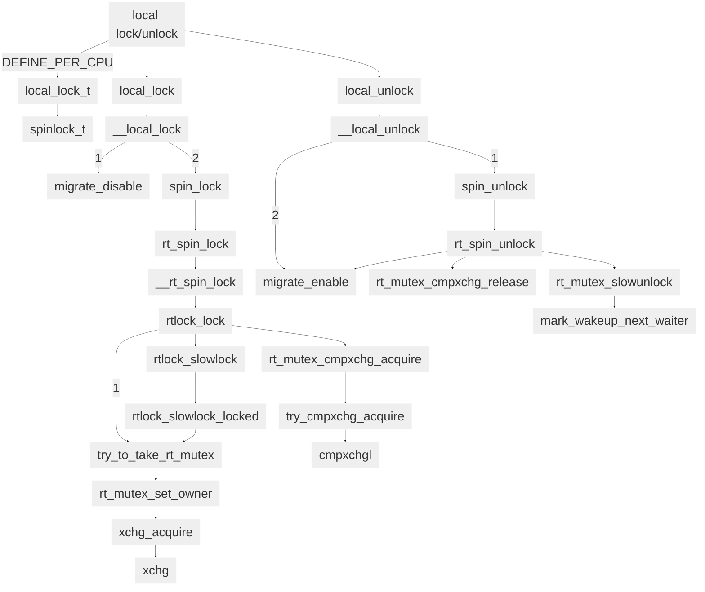
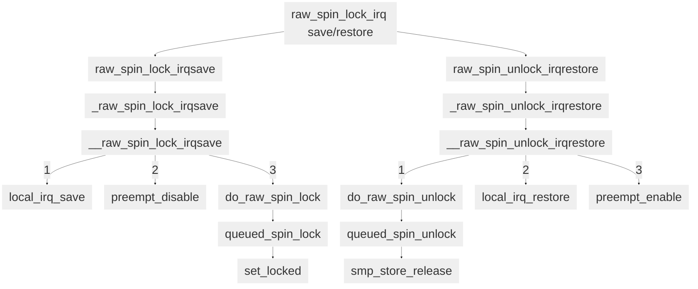

```mermaid
%%{
	init: {
		'theme': 'base',
		'themeVariables': {
        'primaryColor': '#eeee',
        'primaryBorderColor': '#ffff',
			'fontSize':'50px'
		}
	}
}%%
graph TB
raw_spin_irq["raw_spin lock/unlock irq"]
raw_spin_irq --> raw_spin_lock_irq & raw_spin_unlock_irq
raw_spin_lock_irq -->_raw_spin_lock_irq
-->__raw_spin_lock_irq
__raw_spin_lock_irq -->|1| local_irq_disable
__raw_spin_lock_irq -->|2| preempt_disable
__raw_spin_lock_irq -->|3| do_raw_spin_lock

raw_spin_unlock_irq --> _raw_spin_unlock_irq --> __raw_spin_unlock_irq
__raw_spin_unlock_irq -->|1| do_raw_spin_unlock
__raw_spin_unlock_irq -->|2| local_irq_enable
__raw_spin_unlock_irq -->|2| preempt_enable

