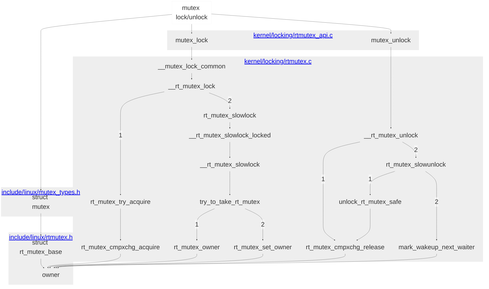
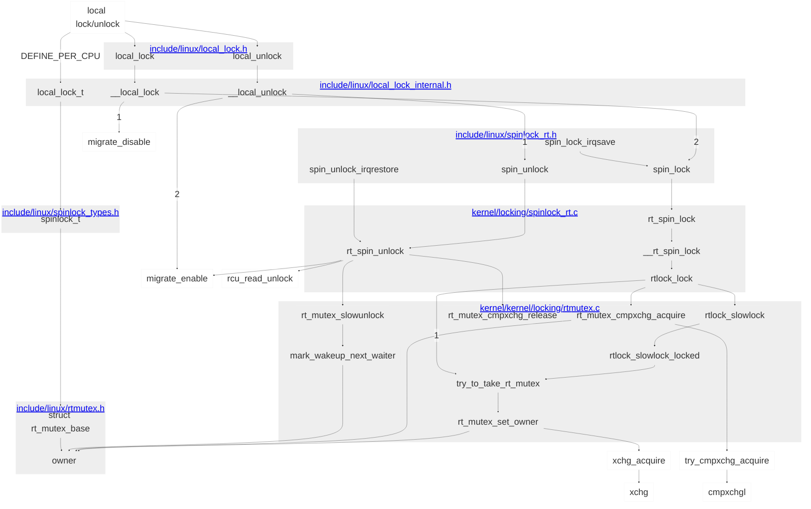

## Internals of Real-Time Specific Locks

Draft — feedback and corrections are welcome.

### Mutex

```mermaid
%%{
	init: {
		'theme': 'base',
		'themeVariables': {
			'primaryColor': '#eeee',
        		'primaryColor': '#fff0',
        		'primaryBorderColor': '#eeef',
			'clusterBkg': '#eeef',
			'fontSize':'50px'
		}
	}
}%%
graph TB

mutex0["mutex lock/unlock"]
mutex0 --> mutex & mutex_lock & mutex_unlock

subgraph "<a href=https://elixir.bootlin.com/linux/latest/source/include/linux/rtmutex.h>include/linux/rtmutex.h</a>"
rt_mutex_base["struct rt_mutex_base"] --> owner
end
subgraph "<a href=https://elixir.bootlin.com/linux/v6.14.5/source/include/linux/mutex_types.h>include/linux/mutex_types.h</a>"
mutex["struct mutex"] --> rt_mutex_base
end

subgraph "<a href='https://elixir.bootlin.com/linux/latest/source/kernel/locking/rtmutex_api.c'>kernel/locking/rtmutex_api.c</a>"
mutex_lock
mutex_unlock
end

subgraph "<a href='https://elixir.bootlin.com/linux/latest/source/kernel/locking/rtmutex.c'>kernel/locking/rtmutex.c</a>"
mutex_lock --> __mutex_lock_common
mutex_unlock --> __rt_mutex_unlock

__mutex_lock_common --> __rt_mutex_lock
__rt_mutex_lock -->|1| rt_mutex_try_acquire --> rt_mutex_cmpxchg_acquire --> owner
__rt_mutex_lock -->|2| rt_mutex_slowlock
--> __rt_mutex_slowlock_locked --> __rt_mutex_slowlock --> try_to_take_rt_mutex
try_to_take_rt_mutex -->|1| rt_mutex_owner --> owner
try_to_take_rt_mutex -->|2| rt_mutex_set_owner --> owner

__rt_mutex_unlock -->|1| rt_mutex_cmpxchg_release --> owner
__rt_mutex_unlock -->|2| rt_mutex_slowunlock

rt_mutex_slowunlock -->|1| unlock_rt_mutex_safe --> rt_mutex_cmpxchg_release
rt_mutex_slowunlock -->|2| mark_wakeup_next_waiter --> owner

end
owner

```

### Local lock and spinlock

```mermaid
%%{
	init: {
		'theme': 'base',
		'themeVariables': {
        		'primaryColor': '#fff0',
        		'primaryBorderColor': '#eeef',
			'clusterBkg': '#eeef',
			'fontSize':'50px'
		}
	}
}%%
graph TB
local["local lock/unlock"] -->|DEFINE_PER_CPU| local_lock_t
local --> local_lock & local_unlock
local_lock_t ----> spinlock_t
subgraph "<a href=https://elixir.bootlin.com/linux/latest/source/include/linux/rtmutex.h>include/linux/rtmutex.h</a>"
rt_mutex_base["struct rt_mutex_base"] --> owner
end

subgraph "<a href=https://elixir.bootlin.com/linux/latest/source/include/linux/spinlock_types.h>include/linux/spinlock_types.h</a>"
spinlock_t --> rt_mutex_base
end

subgraph "<a href=https://elixir.bootlin.com/linux/latest/source/include/linux/local_lock.h>include/linux/local_lock.h</a>"
local_lock
local_unlock
end
subgraph "<a href=https://elixir.bootlin.com/linux/latest/source/include/linux/local_lock_internal.h>include/linux/local_lock_internal.h</a>"
local_lock_t
__local_lock
__local_unlock
end
subgraph "<a href=https://elixir.bootlin.com/linux/latest/source/include/linux/spinlock_rt.h>include/linux/spinlock_rt.h</a>"
spin_lock_irqsave --> spin_lock
spin_unlock
spin_unlock_irqrestore
end
subgraph "<a href=https://elixir.bootlin.com/linux/latest/source/kernel/locking/spinlock_rt.c>kernel/locking/spinlock_rt.c</a>"
rt_spin_lock --> __rt_spin_lock --> rtlock_lock
spin_unlock_irqrestore --> rt_spin_unlock
end
local_lock --> __local_lock -->|1| migrate_disable
__local_lock --->|2| spin_lock --> rt_spin_lock
rtlock_lock -->|1| try_to_take_rt_mutex

subgraph "<a href=https://elixir.bootlin.com/linux/latest/source/kernel/kernel/locking/rtmutex.c>kernel/kernel/locking/rtmutex.c</a>"
rtlock_lock --> rtlock_slowlock --> rtlock_slowlock_locked
--> try_to_take_rt_mutex --> rt_mutex_set_owner
rtlock_lock --> rt_mutex_cmpxchg_acquire
rt_mutex_cmpxchg_release
rt_mutex_slowunlock --> mark_wakeup_next_waiter --> owner
end
rt_mutex_cmpxchg_acquire --> owner
rt_mutex_cmpxchg_acquire -----> try_cmpxchg_acquire --> cmpxchgl

rt_mutex_set_owner --> owner
rt_mutex_set_owner --> xchg_acquire -->xchg

local_unlock --> __local_unlock --->|1| spin_unlock
__local_unlock -->|2| migrate_enable
spin_unlock ---> rt_spin_unlock
--> migrate_enable & rt_mutex_cmpxchg_release & rt_mutex_slowunlock

rt_spin_unlock --> rcu_read_unlock

```

