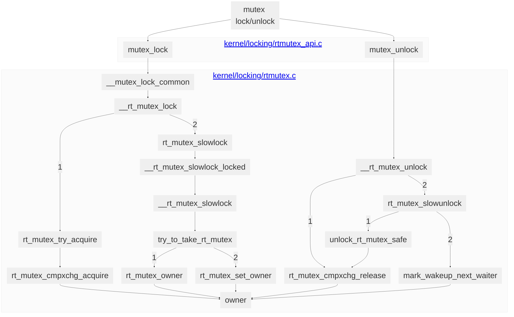
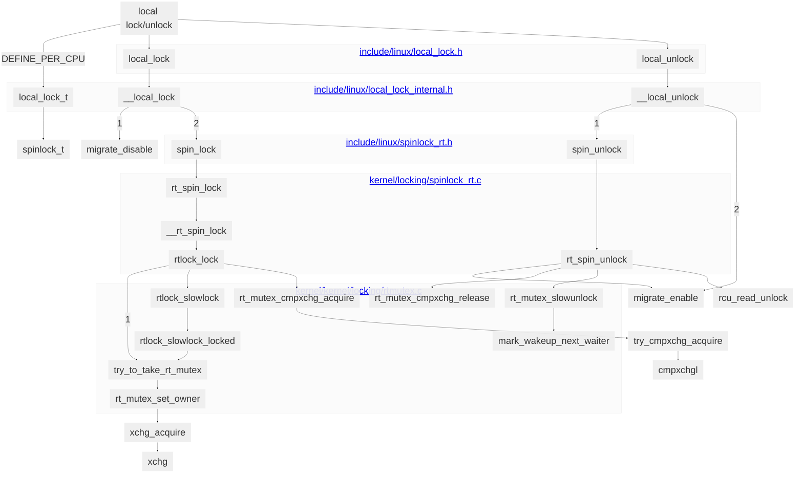
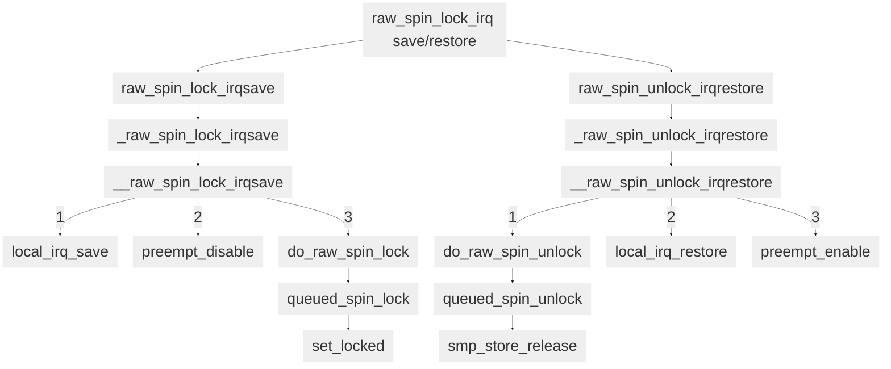
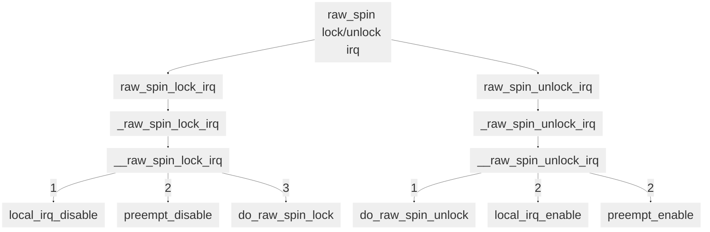

## Internals of Real-Time Specific Locks

### Mutext lock and unlock

```mermaid
%%{
  init: {
    'theme': 'base',
    'themeVariables': {
        'primaryColor': '#eeee',
        'primaryBorderColor': '#ffff',
      'fontSize':'50px'
    }
  }
}%%
graph TB

mutex["mutex lock/unlock"]
mutex --> mutex_lock & mutex_unlock

subgraph "<a href='https://elixir.bootlin.com/linux/latest/source/kernel/locking/rtmutex_api.c'>kernel/locking/rtmutex_api.c</a>"
mutex_lock
mutex_unlock
end

subgraph "<a href='https://elixir.bootlin.com/linux/latest/source/kernel/locking/rtmutex.c'>kernel/locking/rtmutex.c</a>"
mutex_lock --> __mutex_lock_common
mutex_unlock --> __rt_mutex_unlock

__mutex_lock_common --> __rt_mutex_lock
__rt_mutex_lock -->|1| rt_mutex_try_acquire --> rt_mutex_cmpxchg_acquire --> owner
__rt_mutex_lock -->|2| rt_mutex_slowlock
--> __rt_mutex_slowlock_locked --> __rt_mutex_slowlock --> try_to_take_rt_mutex
try_to_take_rt_mutex -->|1| rt_mutex_owner --> owner
try_to_take_rt_mutex -->|2| rt_mutex_set_owner --> owner

__rt_mutex_unlock -->|1| rt_mutex_cmpxchg_release --> owner
__rt_mutex_unlock -->|2| rt_mutex_slowunlock

rt_mutex_slowunlock -->|1| unlock_rt_mutex_safe --> rt_mutex_cmpxchg_release
rt_mutex_slowunlock -->|2| mark_wakeup_next_waiter --> owner

end
```

### Local lock lock and unlock

```mermaid
%%{
	init: {
		'theme': 'base',
		'themeVariables': {
        'primaryColor': '#eeee',
        'primaryBorderColor': '#ffff',
			'fontSize':'50px'
		}
	}
}%%
graph TB
local["local lock/unlock"]
local -->|DEFINE_PER_CPU| local_lock_t
local --> local_lock & local_unlock
local_lock_t --> spinlock_t
subgraph "<a href=https://elixir.bootlin.com/linux/latest/source/include/linux/local_lock.h>include/linux/local_lock.h</a>"
local_lock
local_unlock
end
subgraph "<a href=https://elixir.bootlin.com/linux/latest/source/include/linux/local_lock_internal.h>include/linux/local_lock_internal.h</a>"
local_lock_t
__local_lock
__local_unlock
end
subgraph "<a href=https://elixir.bootlin.com/linux/latest/source/include/linux/spinlock_rt.h>include/linux/spinlock_rt.h</a>"
spin_lock
spin_unlock
end
subgraph "<a href=https://elixir.bootlin.com/linux/latest/source/kernel/locking/spinlock_rt.c>kernel/locking/spinlock_rt.c</a>"
rt_spin_lock --> __rt_spin_lock --> rtlock_lock
rt_spin_unlock 
end
local_lock --> __local_lock -->|1| migrate_disable
__local_lock -->|2| spin_lock --> rt_spin_lock
rtlock_lock -->|1| try_to_take_rt_mutex

subgraph "<a href=https://elixir.bootlin.com/linux/latest/source/kernel/kernel/locking/rtmutex.c>kernel/kernel/locking/rtmutex.c</a>"
rtlock_lock --> rtlock_slowlock --> rtlock_slowlock_locked
--> try_to_take_rt_mutex --> rt_mutex_set_owner
rtlock_lock --> rt_mutex_cmpxchg_acquire
rt_mutex_cmpxchg_release
rt_mutex_slowunlock --> mark_wakeup_next_waiter
end
rt_mutex_cmpxchg_acquire --> try_cmpxchg_acquire --> cmpxchgl

rt_mutex_set_owner -->xchg_acquire -->xchg

local_unlock --> __local_unlock -->|1| spin_unlock
__local_unlock -->|2| migrate_enable
spin_unlock ---> rt_spin_unlock
--> migrate_enable & rt_mutex_cmpxchg_release & rt_mutex_slowunlock

rt_spin_unlock --> rcu_read_unlock

```

### raw_spin_lock_irq save/restore

```mermaid
%%{
	init: {
		'theme': 'base',
		'themeVariables': {
        'primaryColor': '#eeee',
        'primaryBorderColor': '#ffff',
			'fontSize':'50px'
		}
	}
}%%
graph TB
sr["raw_spin_lock_irq save/restore"]
sr--> raw_spin_lock_irqsave & raw_spin_unlock_irqrestore
raw_spin_lock_irqsave --> _raw_spin_lock_irqsave --> __raw_spin_lock_irqsave
__raw_spin_lock_irqsave -->|1| local_irq_save
__raw_spin_lock_irqsave -->|2| preempt_disable
__raw_spin_lock_irqsave -->|3| do_raw_spin_lock

raw_spin_unlock_irqrestore --> _raw_spin_unlock_irqrestore --> __raw_spin_unlock_irqrestore
__raw_spin_unlock_irqrestore -->|1| do_raw_spin_unlock
__raw_spin_unlock_irqrestore -->|2| local_irq_restore
__raw_spin_unlock_irqrestore -->|3| preempt_enable

preempt_disable
preempt_enable
do_raw_spin_unlock
do_raw_spin_unlock --> queued_spin_unlock --> smp_store_release
do_raw_spin_lock --> queued_spin_lock --> set_locked
```

### raw_spin lock/unlock irq

```mermaid
%%{
	init: {
		'theme': 'base',
		'themeVariables': {
        'primaryColor': '#eeee',
        'primaryBorderColor': '#ffff',
			'fontSize':'50px'
		}
	}
}%%
graph TB
raw_spin_irq["raw_spin lock/unlock irq"]
raw_spin_irq --> raw_spin_lock_irq & raw_spin_unlock_irq
raw_spin_lock_irq -->_raw_spin_lock_irq
-->__raw_spin_lock_irq
__raw_spin_lock_irq -->|1| local_irq_disable
__raw_spin_lock_irq -->|2| preempt_disable
__raw_spin_lock_irq -->|3| do_raw_spin_lock

raw_spin_unlock_irq --> _raw_spin_unlock_irq --> __raw_spin_unlock_irq
__raw_spin_unlock_irq -->|1| do_raw_spin_unlock
__raw_spin_unlock_irq -->|2| local_irq_enable
__raw_spin_unlock_irq -->|2| preempt_enable
```
